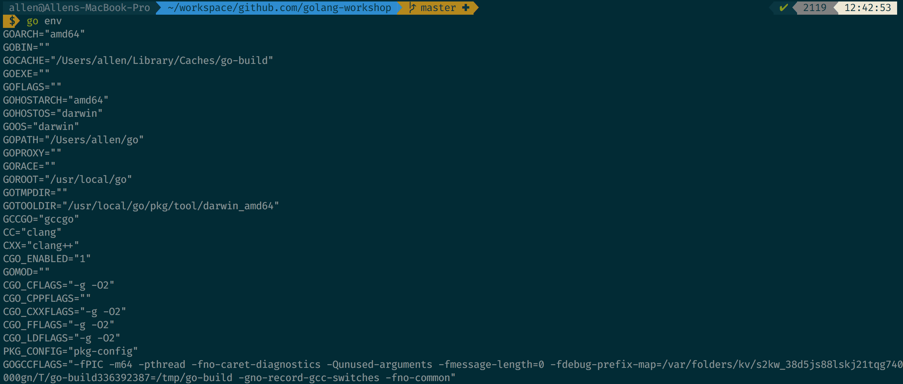

## Installing Go

The latest version of Go is 1.12 released on Feb 2019 and is available to download at https://golang.org/dl/. Folow the setup instructions for your platform. After installation, confirm the installation has worked successfully by typing 

`go version` on the terminal

If you see something like below, then the installation is successfull

`go version go1.12 darwin/amd64`

Also try `go env` to get a complete listing of the values setup by the Golang binary. An example from my machine is given below

Confirm that the `GOROOT` environment variable points to the installation path of Golang on your machine. If not, set the value of `GOROOT` to point to the correct folder through a startup initialization script like `.bashrc` file.

## IDE Installation

Download VSCode for your platform - https://code.visualstudio.com/download

From the extensions, choose the official Go extension (provided by Microsoft) as shown below:

Choose install on the right pane to start the installation of the extension. You will need to restart VSCode after the extension has finished installation for changes to take effect.
