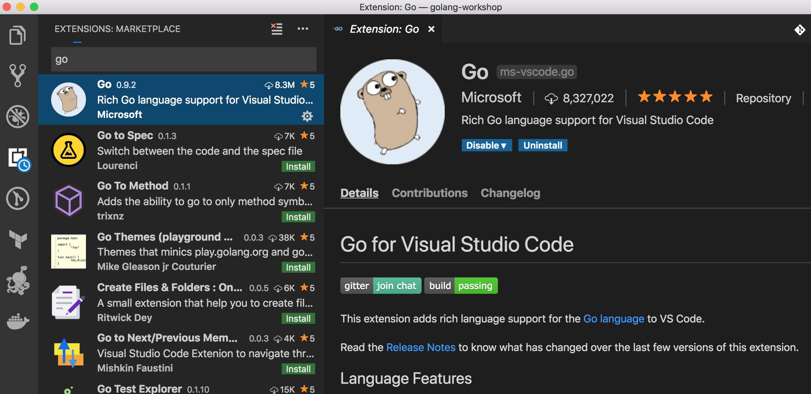

## Installation

Download VSCode for your platform - https://code.visualstudio.com/download

From the extensions, choose the official Go extension (provided by Microsoft) as shown below:

Choose install on the right pane to start the installation of the extension. You will need to restart VSCode after the extension has finished installation for changes to take effect.

